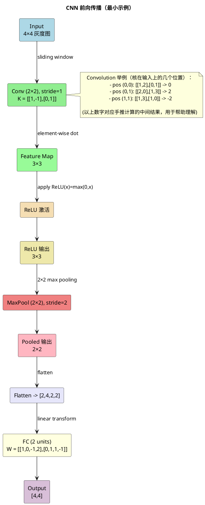

### -1. 输入

我们假设输入是一张 4×4 的灰度图像（单通道）：

X=[1201013121021023]X = \\begin{bmatrix} 1 & 2 & 0 & 1 \\\\ 0 & 1 & 3 & 1 \\\\ 2 & 1 & 0 & 2 \\\\ 1 & 0 & 2 & 3 \\end{bmatrix}---

### 2. 卷积层

卷积核大小 2×2，权重如下，stride=1，不做 padding：

K=[1−101],b=0K = \\begin{bmatrix} 1 & -1 \\\\ 0 & 1 \\end{bmatrix}, \\quad b=0卷积计算：
卷积核在输入上滑动，每个位置做点积。

* 左上角 (覆盖 X 的前 2×2)：

1⋅1+2⋅(−1)+0⋅0+1⋅1=1−2+0+1=01\\cdot1 + 2\\cdot(-1) + 0\\cdot0 + 1\\cdot1 = 1 - 2 + 0 + 1 = 0* 继续计算得到 feature map（3×3 大小）：

C=[02−21−24−122]C = \\begin{bmatrix} 0 & 2 & -2 \\\\ 1 & -2 & 4 \\\\ -1 & 2 & 2 \\end{bmatrix}---

### 3. ReLU 激活

把负数变成 0：

R=[020104022]R = \\begin{bmatrix} 0 & 2 & 0 \\\\ 1 & 0 & 4 \\\\ 0 & 2 & 2 \\end{bmatrix}---

### 4. 池化层

采用 **2×2 最大池化**，stride=2。

* 左上角窗口：max⁡{0,2,1,0}=2\\max\\{0,2,1,0\\}=2
* 右上角窗口：max⁡{0,4}=4\\max\\{0,4\\}=4
* 左下角窗口：max⁡{0,2}=2\\max\\{0,2\\}=2
* 右下角窗口：max⁡{2,2}=2\\max\\{2,2\\}=2

得到 2×2 的池化输出：

P=[2422]P = \\begin{bmatrix} 2 & 4 \\\\ 2 & 2 \\end{bmatrix}---

### 5. 全连接层

把池化结果展平成向量：

[2,4,2,2][2, 4, 2, 2]假设全连接层只有 2 个输出神经元，权重矩阵：

W=[10−12011−1],b=[0,0]W = \\begin{bmatrix} 1 & 0 & -1 & 2 \\\\ 0 & 1 & 1 & -1 \\end{bmatrix}, \\quad b = [0, 0]计算输出：

y=W⋅Pflat+by = W \\cdot P\_{flat} + b第一行：1⋅2+0⋅4+(−1)⋅2+2⋅2=2−2+4=41\\cdot2 + 0\\cdot4 + (-1)\\cdot2 + 2\\cdot2 = 2 - 2 + 4 = 4
第二行：0⋅2+1⋅4+1⋅2+(−1)⋅2=4+2−2=40\\cdot2 + 1\\cdot4 + 1\\cdot2 + (-1)\\cdot2 = 4 + 2 - 2 = 4

最终输出：

y=[4,4]y = [4, 4]---

✅ **流程总结**：

1. 输入：4×4 图像
2. 卷积（2×2 核）：→ 3×3 feature map
3. ReLU：→ 3×3 feature map
4. 池化（2×2）：→ 2×2 feature map
5. 展平 + 全连接：→ 输出向量 [4, 4]

---

要不要我帮你画一个**流程图（卷积核滑动过程 + ReLU + 池化 + FC）**，这样更直观？

我们定义一个极简的CNN来处理一个微小的“图像”：

1. **输入（Input Image）**：

   * 一个 `2x2` 的灰度图像（1个通道）。
   * 像素值： `X = [[1, 2], [3, 4]]`
   * 形状： `(1, 2, 2)` -> (通道数, 高度, 宽度)
2. **卷积层（Convolutional Layer）**：

   * 使用 **1个** 卷积核。
   * 卷积核大小： `2x2`
   * 卷积核权重： `W = [[0.5, 0.2], [0.1, 0.3]]`
   * 偏置（Bias）： `b = 0.1`
   * 步长（Stride）： `1`
   * 填充（Padding）： `0` (即不使用填充)
3. **激活函数（Activation Function）**：

   * 使用 **ReLU**： `ReLU(x) = max(0, x)`
4. **池化层（Pooling Layer）**：

   * 使用 **最大池化（Max Pooling）**。
   * 池化窗口大小： `2x2`
   * 步长（Stride）： `2` (通常步长等于窗口大小，确保不重叠)

---

### 前向传播手推步骤

#### 第1步：卷积操作 (Convolution)

我们的卷积核 `W` (2x2) 需要在输入 `X` (2x2) 上滑动。由于没有填充且步长为1，卷积核只能放在一个有效的位置上（从左上角开始）。

**计算过程：**

1. 将卷积核覆盖在输入图像的左上角。
2. 进行**元素对应相乘再求和（点积）**的操作。
3. 加上偏置 `b`。

卷积计算：
`(1 * 0.5) + (2 * 0.2) + (3 * 0.1) + (4 * 0.3) + 0.1`
让我们一步步计算：
`= (0.5) + (0.4) + (0.3) + (1.2) + 0.1`
`= 2.5`

**输出特征图（Feature Map）**：
卷积操作产生一个单值，所以我们的特征图是 `1x1`。
`Z = [[2.5]]`

*图示：卷积核在输入上滑动并进行点积操作*

#### 第2步：激活函数 (ReLU)

将卷积层的输出 `Z` 输入到ReLU激活函数中。

`A_conv = ReLU(Z) = ReLU(2.5) = 2.5`
(因为 2.5 > 0)

**输出**： `A_conv = [[2.5]]` (形状: `1x1`)

#### 第3步：池化操作 (Max Pooling)

现在，将激活后的特征图 `A_conv` (`1x1`) 输入到池化层。

* 池化窗口是 `2x2`。
* 我们的输入也是 `1x1`，所以窗口刚好覆盖整个输入。
* 在这个唯一的窗口内，最大值就是 `2.5`。

**输出**： `P = [[2.5]]` (形状: `1x1`)

---

### 最终输出与总结

经过这一系列操作，我们CNN的前向传播将 `2x2` 的输入图像，最终转换为了一个 `1x1` 的特征值 `2.5`。

**数据形状变化流程总结：**

| 层 (Layer)     | 操作                         | 输入形状 (CHW) | 输出形状 (CHW) | 输出值          |
| :------------- | :--------------------------- | :------------- | :------------- | :-------------- |
| **输入图像**   | -                            | (1, 2, 2)      | (1, 2, 2)      | `[[1,2],[3,4]]` |
| **卷积层**     | 1个`2x2` 核，Stride=1, Pad=0 | (1, 2, 2)      | (1, 1, 1)      | `[[2.5]]`       |
| **ReLU激活层** | `max(0, x)`                  | (1, 1, 1)      | (1, 1, 1)      | `[[2.5]]`       |
| **最大池化层** | `2x2` 窗口，Stride=2         | (1, 1, 1)      | (1, 1, 1)      | `[[2.5]]`       |
| **最终输出**   | -                            | -              | (1, 1, 1)      | `2.5`           |

**核心要点：**

1. **卷积**：使用一个小窗口（卷积核）在输入上滑动，通过**点积**提取局部特征。参数共享发生在这里。
2. **激活函数**：引入非线性，使网络可以学习更复杂的模式。
3. **池化**：进行下采样，降低数据维度，增加特征的平移不变性。

# CNN 前向传播（PlantUML）

